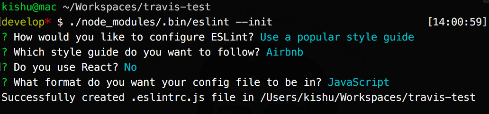
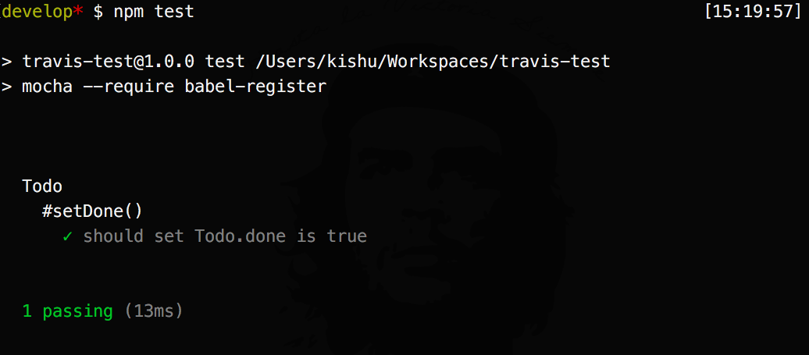
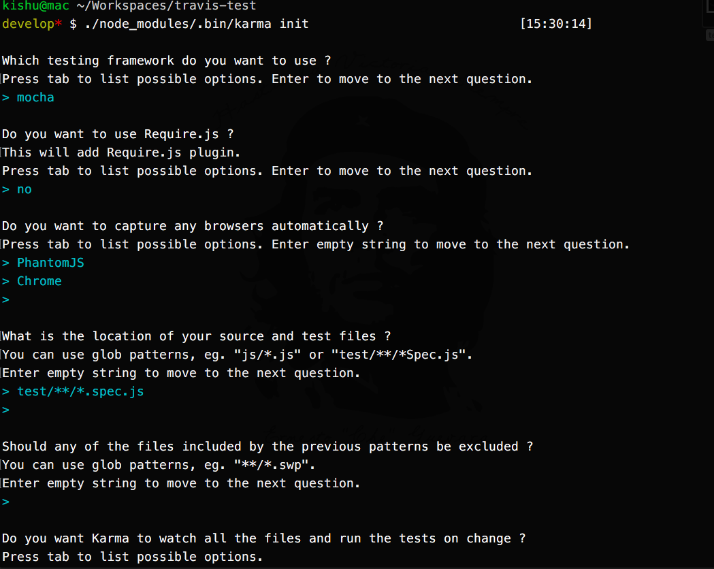
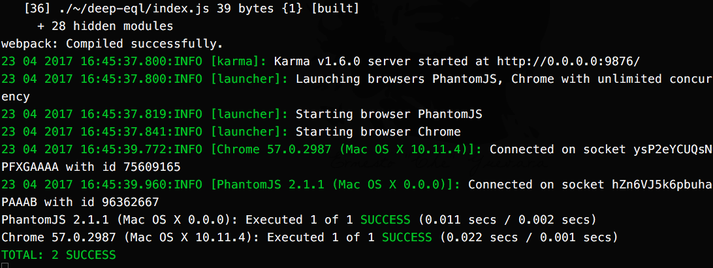
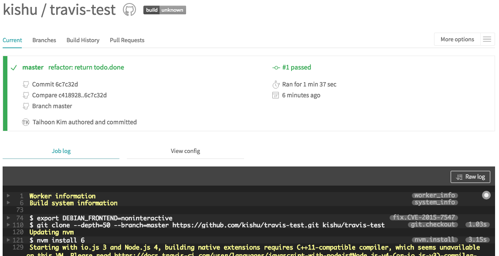

Travis CI
===

---

# CI(Continuous integration)

UML 개발자인 그래디부치가
1991년 객체 지향 프로그램을 개발하기 위한 방법을 제안하면서 CI를 소개

개발자들이 작업하는 코드를
메인저장소에서 하루에 여러 번 병합해야 한다고 주장

XP는 이 개념을 받아들이고 하루에 한 번 이상 통합하는 것을 권장

---

# Travis

어원은 고대 프랑스어
"to cross over" 통과하다. 넘어가다.

다리, 게이트 등을 지키며 통행료를 징수하던 사람. 문지기.

Travis는 이런 느낌
>여기를 지나가려면 테스트를 거쳐야해.
통과해야만 너의 코드를 통합하고 배포 할 수 있을꺼야.


---


# workspace & npm init

``` sh
$ cd your/work/path
$ mkdir travis-test
$ cd travis-test
$ npm init
```

---

# .editorconfig

``` text
# top-most EditorConfig file
root = true

# Unix-style newlines with a newline ending every file
[*]
charset = utf-8
end_of_line = lf
insert_final_newline = true
indent_style = tab

[{package.json,.travis.yml}]
indent_style = space
indent_size = 2
```

---

# .gitignore 생성


---

# eslint 설정

``` bash
$ npm install eslint --save-dev
$ ./node_modules/.bin/eslint --init
```



---

# eslintrc.js

``` js
"rules": {
  "no-tabs": "off",
  "indent": ["error", "tab"],
  "quotes": ["error", "double"]
}
```

package.json

``` json
"scripts": {
  "eslint": "eslint .eslintrc.js src/"
}
```

---

# babel & webpack 설정

``` bash
$ npm install webpack webpack-dev-server --save-dev
$ npm install babel-core babel-register babel-preset-env --save-dev
```

---

# babel.rc

``` json
{
  "presets": ["env"]
}

```

---

# webpack.config.js

```
const path = require("path");

module.exports = {
  entry: "./src/app.js",
  output: {
    path: path.resolve(__dirname, "dist"),
    filename: "bundle.js"
  },
```

---

``` js
  module: {
    rules: [
      {
        test: /\.js$/,
        exclude: /(node_modules|bower_components)/,
        use: {
          loader: "babel-loader"
        }
      }
    ]
  },
  devServer: {
    publicPath: "/dist/"
  },
};
```

---

package.json

``` json
"scripts": {
  "start": "webpack-dev-server",
  "build": "webpack"
}
```

---

# src/todo.js

``` js
class Todo {
  constructor(title) {
    this.setTitle(title);
    this.setDone(false);
  }
  getDone() {
    return this.done;
  }
  getTitle() {
    return this.title
  }
  setDone(done) {
    this.done = done;
  }
  setTitle(title) {
    this.title = title;
  }
}

export default Todo;
```

---

# src/app.js

``` js
import Todo from "./todo";

const todo = new Todo("New todo");
console.log(todo.getTitle());
```

---

# build

## dev-server
``` bash
$ npm start 
```

checkout browser

## build dist files
```
$ npm build 
```

checkout dist/ directory

---

# mocha & chai 설정

``` bash
$ npm install mocha chai --save-dev
```

package.json

``` json
"scripts": {
  "test": "mocha --require babel-register"
}
```

---


# test/todo.spec.js

``` js
import chai from "chai";
import Todo from "../src/todo";

const expect = chai.expect;

describe("Todo", () => {
  const todo = new Todo("test todo");
  describe("#setDone()", () => {
    it("should set Todo.done is true", () => {
      todo.setDone(true);
      let done = todo.getDone();
        expect(done).to.equal(true);
      });
  });
});
```

---

# test 실행

``` bash
npm test
```



---

# karma 설정

``` bash
$ npm install karma karma-webpack-preprocessor --save-dev
$ npm install karma-phantomjs-launcher karma-chrome-launcher --save-dev

$ ./node_modules/.bin/karma init
```

---



---

# karma.config.js 설정

``` js
const webpack = require("./webpack.config");

module.exports = function(config) {
  ..
  preprocessors: {
    "test/**/*.spec.js": ["webpack"],
  },
  webpack: webpack,
  ..
};
```

---

# karma 실행

``` bash
$ npm run karam
```



---

# .travis.yml 설정

``` yml
language: node_js
node_js:
  - "6"
install:
  - npm install
script: node_modules/karma/bin/karma start --single-run --browsers PhantomJS
```

여기까지 PUSH

---

# travis

travis 사이트 account에서 리파지토리 활성화
코드 수정 후 다시 push 하면 travis가 동작



---

# travis 배지

`README.md`에 상태를 볼 수 있는 배지를 붙힌다.

```

```


